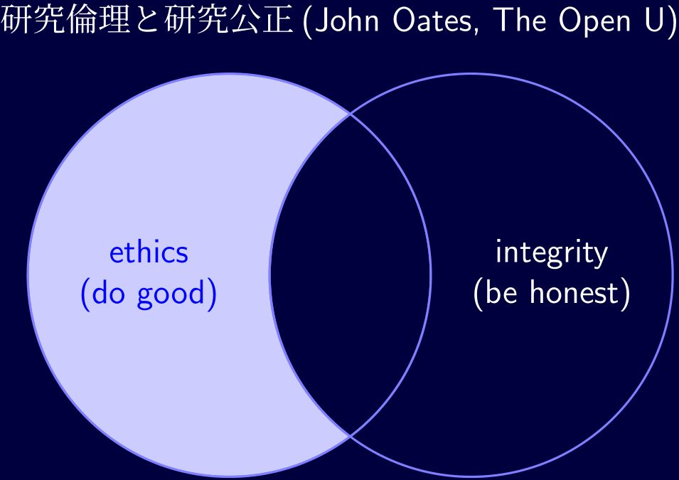
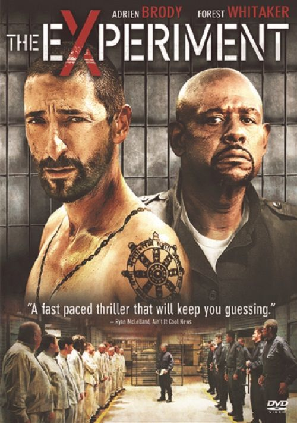
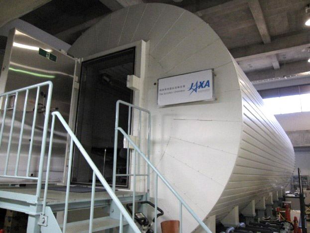

class: inverse, middle, center
```{r setting, eval = T, cache = T, warning = F, message = F, echo = F}
library(RefManageR)
myBib <- ReadBib("c:/seiro/settings/TeX/seiro.bib")
BibOptions(max.names = 3)
```
```{r xaringan setup, include=FALSE, warning=FALSE}
library(RefManageR)
library(xaringanthemer)
####style_mono_dark(base_color = "#cbf7ed")
####style_mono_light(base_color = "#23395b")
style_solarized_light(
  text_color = "black", 
  title_slide_background_color = "darkblue",
  link_color = "green")
#### xaringancolor setup
library(xaringancolor)
xaringancolor::setup_colors(
  red ="red",
  green = "green",
  blue = "blue"
)
```
```{r xaringan-panelset, echo=FALSE, warning = F}
library(xaringanExtra)
use_panelset()
```
<style>
.red {color: #FF0000;}
.green {color: #00FF00;}
.blue {color: #0000FF;}
.lightblue {color: #33E7FF;}
</style>
```{r flair_color, echo=FALSE}
library(flair)
red <- "#FF0000"
green <- "#00FF00"
blue <- "#0000FF"
```
```{css echo=FALSE}
.highlight-last-item > ul > li,
.highlight-last-item > ol > li {
  opacity: 0.5;
}
.highlight-last-item > ul > li:last-of-type,
.highlight-last-item > ol > li:last-of-type {
  opacity: 1;
}
.inverse {
  background-color: #00003c;
  color: #d6d6d6;
  text-shadow: 0 0 20px #333;
}
mark.red {
    color:#ff0000;
    background: none;
}
mark.blue {
    color:#0000A0;
    background: none;
}
.my-style {
  font-weight: bold;
  font-style: italic;
  font-size: 1.5em;
  color: red;
}
.large {
  font-size: 2em;
}
blockquote {
  border-left: .2px solid #275d38;
  margin: -5px 80px -5px 20px;
  padding-top: -0.5px;
  padding-bottom: -0.5px;
  line-height: 1.35em;
}
.pull-left60 {
  float: left;
  width: 57%;
  padding-right: 2px
  margin-top: -1em;
  margin-bottom: 0em;
}
.pull-right40 {
  float: right;
  width: 37%;
  padding-left: 2px
  margin-top: -1em;
  margin-bottom: 0em;
}
.pull-left70 {
  float: left;
  width: 67%;
  padding-right: 2px
  margin-top: -1em;
  margin-bottom: 0em;
}
.pull-right30 {
  float: right;
  width: 29%;
  padding-left: -4px
  margin-top: -1em;
  margin-bottom: 0em;
}
.pull-left75 {
  float: left;
  width: 73%;
  padding-right: 2px
  margin-top: -5em;
  margin-bottom: 0em;
}
.pull-right25 {
  float: right;
  width: 22%;
  padding-left: 2px
  margin-top: -5em;
  margin-bottom: 0em;
}
.pull-left50 {
  float: left;
  width: 50%;
  padding-right: 0px;
  padding-left: 0px;
  margin-top: 0em;
  margin-bottom: 0em;
}
.pull-right50 {
  float: right;
  width: 50%;
  padding-right: 0px;
  padding-left: 0px;
  margin-top: 0em;
  margin-bottom: 0em;
}
.pull-right50jaxa {
  float: right;
  width: 50%;
  padding-right: 0px;
  padding-left: 0px;
  margin-top: 0em;
  margin-bottom: -5em;
}
.pull-left20 {
  float: left;
  width: 18%;
  padding-right: 2px
  margin-top: -1em;
  margin-bottom: 0em;
}
.pull-right80 {
  float: right;
  width: 79%;
  padding-left: -4px
  margin-top: -1em;
  margin-bottom: 0em;
}
.pull-left100 {
  float: left;
  width: 100%;
  padding-right: 0px;
  padding-left: 0px;
  margin-top: 0em;
  margin-bottom: 0em;
}
.pull-right {
  float: right;
  width: 100%;
  padding-right: 0px;
  padding-left: 0px;
  margin-top: 0em;
  margin-bottom: 0em;
}
.center2 {
  margin: 0;
  position: absolute;
  top: 50%;
  left: 50%;
  -ms-transform: translate(-50%, -50%);
  transform: translate(-50%, -50%);
}
```
# 研究倫理

## 2024年度新入職員研修

<br>
### 開発研究センター 
### 伊藤成朗
### 2024年4月17日(水)
---
class: inverse, middle, center

### https://seiroito.github.io/Miscellaneous/2024/KenkyuRinriSlides.html

---
class: inverse, middle, center
## 仕事は社会・業界の行動規範の範囲内で実施します

## 法令、組織の規則、社会通念、業界通念

## 研究業界(学界+その周辺)にも特有の規範=研究倫理があります
---
class: inverse, middle, center
## 本講義の目的: 研究コミュニティに身を置く者が研究倫理逸脱で失敗しないようにすること

## 崇高な研究哲学論ではなく、実際的な自衛の話
---
class: inverse, middle, center
# 研究倫理 = {狭義の研究倫理,  研究公正}
---
class: inverse
.pull-left75[]
.pull-right25[### 極言すると  ]

--

### 研究倫理とは  

--

## 研究で対象社会に.red[迷惑をかけない]という原則  

--

### 研究公正とは  

--

## 研究で.red[ごまかしをしない]という原則  

--

### 対象社会は日本や学界も含みます
---
class: inverse
<p style="margin-top:0cm;">
</p>

### 研究は社会と契約を結んで実施しています  

--

### よって、これらは最低限の原則です  

--

### それでも足をすくわれる研究者はいます

--

### どう判断すれば分からなくなったとき、大原則に戻ると考えやすいです  

--

## .red[社会から託された信任を裏切らない]  

---
class: inverse
name: REAndRI

.pull-left70[

]

--

.pull-right30[
<br>
* Do good for the society (not just for oneself/clients).  
]

--

.pull-right30[
<br>
* Be honest to the scientific standard (not just to oneself).  
]

--

.pull-right30[
ごまかしのある研究は社会に迷惑をかけるように、研究公正と研究倫理はきれいに分かれず、相互に関連する部分があります
]

--
<p style="margin-top:3cm;">
.pull-left100[
   
]
</p>


.pull-left100[
]

.pull-left100[
[研究公正の鳥瞰図研究](https://www.vitae.ac.uk/vitae-publications/research-integrity-a-landscape-study) が示す研究公正のキーワード: honest, rigorous, transparent, open, respect and stewardship of research, care for the people of research.
]
---
class: inverse, middle, center
background-image: url("JAXASumimasen.jpg")
background-size: 100%
# .lightblue[研究公正 research integrity]
---
class: inverse, middle, center

写真はJAXA記者会見映像からキャプチャしました
---
class: inverse, middle, center
# 科学的根拠をもとに研究し、得た知識を歪めずに発表すること。
---
class: inverse, middle, center
# 研究公正は、やってはいけないことで定義されます。
---
class: inverse
<p style="margin-top:-1cm;">
</p>
## .red[一発退場 Research misconducts] (.lightblue[FFP], [厚労省研究不正ガイドライン「特定不正行為」](https://www.mhlw.go.jp/file/06-Seisakujouhou-10600000-Daijinkanboukouseikagakuka/0000152685.pdf#page=8))

--

<p style="margin-top:-2cm;">
</p>
.pull-left70[
### .lightblue[F].orange[abrication ねつ造]「存在しないデータや研究成果を作成すること。」  
### .lightblue[F].orange[alsification 改ざん]「操作」によって「データ」や「成果などを真正でないものに加工すること」。  
### .lightblue[P].orange[lagerism 剽窃、盗用] 他の研究者の「アイディア」「方法」「データ」「結果」を「了解または適切な表示なく流用すること」。
]
--
.pull-right30[
* やると研究者人生が終わります。  
]
--
.pull-right30[
* 理由: 研究者社会は相互信頼で成立しています。ウソをつかないことを前提に評価がされて、知識が共有されます。裏切ると、研究者社会全体が資源を浪費するので、厳罰処分されます。不正が露見するまで、他の研究者は存在しない現象を追求して苦しみます。  
]
--
.pull-right30[
   * STAP論文: 追試資源や継続研究資源の浪費、周辺研究まで疑いの目
]
---
class: inverse
<p style="margin-top:-1cm;">
</p>
## .yellow[信用失墜] .orange[Questionable research practices (QRPs)]
<p style="margin-top:0cm;">
</p>
.pull-left60[
  .large[
* データの未保存や再現性の欠如  
* 不適切な統計手法  
* ギフト・オーサーシップ ([CRediT](https://www.elsevier.com/authors/policies-and-guidelines/credit-author-statement))  
* 論文の多重投稿  
* 利益相反によるバイアス  
  ]
]

--

<p style="margin-top:1cm;">
</p>
.pull-right40[
* 識者によって内容が異なるので幾つか列記  
* $P$-hacking: E.g.,  望んだ結果が出るまで推計を試行し、その結果のみ提示すること  
* GAは贈賄双方に便益あり、[なくなりにくい、でも、著者責任も付いてくる](https://www.bmj.com/content/309/6967/1456#:~:text=Perhaps%20this%20scandal%20will%20finally%20undermine%20gift%20authorship.%20At%20the%20very%20least%20it%20should%20make%20researchers%20think%20hard%20about%20the%20responsibilities%20that%20come%20with%20putting%20their%20names%20on%20papers.)   
* 刊行された論文を翻訳して投稿してはいけません ([International Committee of Medical Journal Editors](https://www.icmje.org/recommendations/browse/publishing-and-editorial-issues/overlapping-publications.html#:~:text=Authors%20should%20not%20submit%20the%20same%20manuscript%2C%20in%20the%20same%20or%20different%20languages%2C%20simultaneously%20to%20more%20than%20one%20journal.))、翻訳であることを明示しても危ういので、翻訳論文はワーキング・ペーパーに留めましょう  
]

--

.pull-left100[
See a list of QRPs used in Dutch national survey (DNSRI) summarised [here](https://htmlpreview.github.io/?https://github.com/SeiroIto/PaperNotes/blob/main/QRPsInDutchNationalSurvey_Tufte.html)
]
---
class: inverse
### 蔓延度は不明ですが、結構深刻では?

.orange[例1:] Dutch National Survey on Research Integrity [`r Citep(myBib, "Gopalakrishnaetal2022")`](https://journals.plos.org/plosone/article?id=10.1371/journal.pone.0263023&fbclid=IwAR17MW5qz2wpZXQz6crAQVrsDbGsx0DKeE5ZIuvIywF137rYlf_5hXz1Alw): 

* 15大学+7医学研究所、大学院生以上、`r 63778-1913`人メール送達、6813人回答(`r round(100*6813/(63778-1913), 0)`%)、過去3年  
* 人文科学(全体の`r round(100*636/6813, 0)`%)、社会・行動科学(同`r round(100*1965/6813, 0)`%)、生命・医学科学(同`r round(100*2747/6813, 0)`%)、自然・工学科学(同`r round(100*1465/6813, 0)`%)  
* 大学院生(全体の`r round(100*2013/6813, 0)`%)でも準教授以上(同`r round(100*2066/6813, 0)`%)でも傾向はほぼ同じ  

<p style="margin-top:-.5cm;">
</p>
.pull-left50[
FF(P) 8.3% engaged in any FF(P).  
QRP 51.3% engaged frequently in at least 1 QRP.  
]
--
.pull-right50[
Beh&Soc.Sci 5.7%  
Beh&Soc.Sci 50.2%
]

--

.orange[例2:] The International Research Integrity Survey `r Citep(myBib, "Allumetal2022")`:   

* Web of Scienceのジャーナル21894誌・本、2016-2020年、816万 &rarr; 392万 &rarr; 375万 &rarr; 307万2372 (対象国: 米欧)  
* Stratified random sampling (strata=natural, medical, social sciences and humanities)  
* (おそらく)307万にemail送付  &rarr; 73757が回答 (ウェイト後回答率=7.2%)  &rarr; 64074 (分析標本サイズ)  
* 過去3年のQRP  

--

<p style="margin-top:-1.0cm;">
</p>
.pull-left50[
ギフト・オーサーシップ: 69%(欧)、55%(米)  
予想と矛盾する結果の秘匿: 25%以上(欧)、20%以上(米)  
剽窃: 10%未満(欧)、10%未満(米)  
]

--
.pull-right50[
自然科学: 30%以上(欧)、30%以上(米)  
医学科学: 30%以上(欧)、25%以上(米)  
社会科学: 30%以上(欧)、20%以上(米)  
人文科学: 20%以上(欧)、15%以上(米)  
]

---
class: inverse
### 蔓延度は不明ですが、結構深刻では?

.orange[例3:] [Data Collada (psychologist blog)](https://datacolada.org/) vs. Francesca Gino (HBS prof), 2021-  

* Convincing evidence of data tampering in several of her work on dishonesty (incl. with Dan Ariely!)  
* HBS put Gino on an admin leave, hired file forensic investigators, and sent retraction requests to journals  
* Gino sued these folks and Harvard for lost incomes and damages which is costing them exhorbitant legal fees, and asking for "not less than $25 million"  
* [The problem, though, is that it will take years --- and be extraordinarily expensive --- to settle](https://www.vox.com/future-perfect/2023/8/9/23825966/francesca-gino-honesty-research-scientific-fraud-defamation-harvard-university#:~:text=The%20problem%2C%20though%2C%20is%20that%20it%20will%20take%20years%20%E2%80%94%20and%20be%20extraordinarily%20expensive%20%E2%80%94%20to%20settle)
* [150人あまりの共著者たちはどの論文は不正がないか調べる羽目に](https://www.science.org/content/article/after-honesty-researcher-s-retractions-colleagues-expand-scrutiny-her-work#:~:text=This%20week%2C%20Simonsohn%20and%20five%20other%20Gino%20co%2Dauthors%20emailed)  

--

.orange[例4:] [国立医薬品食品衛生研究所職員による研究活動上の不正行為及びISO/IEC 17025認定審査対応における不適切行為に関する調査結果の公表](https://www.nihs.go.jp/oshirasejoho/Press-Release/20231226/index.html) 2023年12月26日、食品衛生部長によるFabrication, Falsification認定
---
class: inverse

## なぜFFPをするのか

--

### Gino: HBS給与は1.4億円+印税+講演料、ばれなければ大金

--

* 日本の文系(<2000万円)だとFFPは割に合いません  
* 国立医薬品食品衛生研究所所長で1900万円くらい

--

## 結構ばれる: Ginoは追試、食品衛生部長は内部通報  

--

## 貧乏くじ

--

### オッズをよく知らないまま、自ら進んで引くのは賢くない
---
class: inverse

## 自分は本当に大丈夫か?

--

<p style="margin-top:-1.5cm;">
</p>
.pull-left50[
### アジ研: 外部から内部研究者成果に剽窃を指摘される事例(2010年代、2024)  

### 公正な研究?  
]

--

.pull-right50[
<br>
* どのように組織が対処したか知ると学びの機会になります  
]

--

.pull-right50[
* 成果を冗長に書く  
* 要約が不正確  
* どのような過程を踏んだか明記しない  
* 図表の脚注に留意事項を説明するが本文は無記載  
* 研究なのにダークパタン  
* 過去著作の数段落を明示せずコピー、参考文献に掲載  
]

--
.pull-left100[
]
.pull-left50[
### Githubで研究過程を公開

### ピア・レビューを活用  
]

--
<p style="margin-top:1.0cm;">
</p>
.pull-right50[

### [こんな感じ](https://github.com/SeiroIto)です
]
---
class: inverse

## なぜQRPをするのか

--

## 成果を出したい、でも、今のままだと成果にならないと考えている

--
.pull-left50[
### 内容が不十分な場合

* 結果がはっきりしない  
* 2つの結果が矛盾する  
* 何を議論すべきかもよく分からない  
]

--

.pull-right50[
<p style="margin-top:.5cm;">
</p>

* 不適切な統計手法  
* データの未保存や再現性の欠如  
* 曖昧な記述と結論...QRP?  
   * 結論は曖昧です、と明確に書けばok  
   * 単に記述を不明瞭にするのはごまかし=QRP  

* 過程(データとコード)を公開  
* Pre analysis planを公開・登録  
]
---
class: inverse

## なぜQRPをするのか

--

<p style="margin-top:-1.5cm;">
</p>

.pull-left70[
### 自信、発信力が無い場合

* ビッグ・ネームの推薦を利用したい  
]

--

.pull-right30[

<p style="margin-top:1.5cm;">
</p>

* ギフト・オーサーシップ  
* 反例: ネットワーク理論: Erdős-Rényiモデル. [Erdős](https://en.wikipedia.org/wiki/Paul_Erd%C5%91s)は1525論文掲載  
]

--

<p style="margin-top:-2.5cm;">
</p>

.pull-left100[
]
.pull-left70[
### 時間がない場合

* 今までの研究に手を加えれば新しいものに?  
]

--

.pull-right30[

<p style="margin-top:1.5cm;">
</p>

* 多重投稿、多重出版  
* 機械学習で簡単に判明  
]

<p style="margin-bottom:-1.5cm;">
</p>
  
--

<p style="margin-top:-1.5cm;">
</p>
.pull-left100[
]
.pull-left70[
### スポンサーと利益相反するが、研究は健全で余計な詮索をされたくないと考える場合

* 利益相反があることを表明しない  
]

--

.pull-right30[

<p style="margin-top:1.5cm;">
</p>

* 利益相反  

<p style="margin-top:0.5cm;">
</p>

* 簡単に判明  
]

---
class: inverse
## おまけ: 大規模言語モデル(LLM)時代のリスク

--

### ChatGPT謹製論文「この論文書いて」?

* [「ChatGPTでーす、もう一回答えますか?」チャットボット入りの論文](https://pubpeer.com/publications/A9C4E7545D0D3D00A561576BC3B603#)  
* [「AIなので私はアクセスできないのですが」と本文に書いてある論文](https://pubpeer.com/publications/24174D03E640768EDD528C01DD4B8E)  

--

### 「この分野の研究教えて」「この論文の評価を教えて」とLLMを使って良いのか?

--

* 学生が指導教官に尋ねているのと同じです  

--

* 返答をそのまま本文に使うと問題です  

--

   * Ghost authorshipになります  

--

* 仮に返答に剽窃がない場合でも...返答が正しいか自信持てますか?...Hallucinations  
---
class: inverse
## おまけ: 大規模言語モデル(LLM)時代のリスク

### 「この推計コード書いて」「違う表現で書いて」とLLMを使って良いのか?

--

* 研究者がRAを使っているのと同じです  

--

* LLMに謝辞を書けば良い...のか? よく分からない  
   * [ICMJE推奨事項](https://www.icmje.org/news-and-editorials/icmje-recommendations_annotated_jan24.pdf#page=3)ではどのように使ったかを具体的に明示するように要求  

--

* ...出力が正しいか自信持てますか?  
   * 最初のとっかかりを書いてもらうのには使えるか  
   * 他人のコードが何をやっているのかを教えてもらうことはできます  

---
class: inverse
## おまけ: 大規模言語モデル(LLM)時代のリスク

### LLMとどう付き合うか

* 自信過剰な物知りのRA(無休・無給)程度に考えておけばいいのでは  
   * 当然、知ったかぶりして間違えます  

--

* 利用者全員が同じ視点を前提にするようになり、LLMをベースにすると独創性が失われます  
   * 同じLLMでは、類似の質問への回答内容は収斂するため  

--

* 真偽を確かめやすい単純労働を担わせるには良い相手かも  
   * 「以下の出来事を時系列順に並べ替えて、日付と出来事の2列からなるtab separated text形式で出力して」  

---
class: inverse
## おまけ: 大規模言語モデル(LLM)時代のリスク

### 自分の公開論文が学習されて謹製されてしまう可能性

* Github公開は版管理機能があるのでオリジナル論文の証拠になります  
* アジ研DPも同様ですが手間がかかります  
---
class: inverse, middle, center
background-image: url("JAXASumimasen.jpg")
background-size: 100%
# .lightblue[研究倫理 research ethics]
---
class: inverse, middle, center
# 研究対象(者の人権)保護、研究コミュニティの評判維持
---
class: inverse, middle, center
# 研究倫理は、守るべきことで定義されます
---
class: inverse
.pull-left50[

]
.pull-right50[

]
---
class: inverse
### 3つのレイヤー `r Citep(myBib, "Mustajoki2017", after = ", p.37")`

.pull-left20[
 1. 法的義務  
]
.pull-right80[
個人情報保護、人権・動物の権利保護など
]
.pull-left20[
<ol start="2">
<li> ガイドライン  
</ol>
]
.pull-right80[
インフォームド・コンセント、研究の正確さ、貢献の正確さ、研究協力者の表示、など
]
.pull-left20[
<ol start="3">
<li>  暗黙の了解  
</ol>
]
.pull-right80[
? (分野や組織ごとにあるルールなど、らしい)  

* 論文への質問に著者は真摯に答える  
* 内容を批判しても著者の人格まで批判しない  
* 読む前後で自分の知識がどう変わったか書く  
* 研究をより良くするため、読者がより正確に理解するためにコメント・批判をする  
* 問題の指摘で終わらず結論にどう影響するかまで書く  

最後の3つはMacartan Humphreysの[How to critique](https://macartan.github.io/teaching/how-to-critique)から抜粋  
]

---
class: inverse
途上国研究における研究倫理8ポイント `r Citep(myBib, "Emanuel2004")`

1. .orange[Collaborative partnership]	対象個人や社会が便益を受ける研究か。 
1. .orange[Social value]	社会的に価値のある研究か。 
1. .orange[Scientific validity]	.lightblue[科学的裏付け](知見を得る方法論)はあるか。 
1. .orange[Fair subject selection]	 参加者は公平に選ばれたか。 
1. .orange[Favorable risk-benefit ratio]	リスク相応の便益はあるか。個人リスク、社会便益。 
1. .orange[Independent review]	.lightblue[独立機関が審査]したか。 
1. .orange[Informed consent]	.lightblue[インフォームド・コンセント]を得たか。 
1. .orange[Respects for recruited participants and study, communities] 個人や対象社会の.lightblue[意思を尊重]し.lightblue[経過・結果を伝達]したか。 

--

殆どの社会科学研究(=観察研究)  

* 便益は無く、リスクも個人情報漏洩以外は僅少、社会的価値もよく分からないので、参加者を公平に選ぶべき理由は倫理に照らしてあまりない。  
* 審査の独立性、インフォームド・コンセント、個人情報保護、意思の尊重は手続きに関する考慮。科学的裏付けは研究をする動機。 
* あらゆる調査・研究で満たすべき項目であり、研究倫理審査が特別なことをしているわけではない。 
---
class: inverse
.panelset[
	.panel[.panel-name[研究倫理チェックリスト(あらすじ)]

企画段階:  
* やる科学的価値=社会的価値はあるか...既存研究と違いはあるか?  
* 対象選定、標本サイズ、質問票などの研究デザインは十分か=知見が得られる見込みがあるか?  
* 個人情報保護の手段は考えたか?  

実施段階:  
* 研究説明書(research information sheet): 研究の概要と連絡先を説明   
* 研究同意書(informed consent): 参加者の権利+何に同意したのか+署名   
   * いつでも参加拒否できる、いかなる質問にも回答拒否できるなど  
* 必要に応じて研究倫理審査委員会の推薦状、現地IRB (institutional review board)の推薦状・許可状  

分析段階:  
* ハードコピーは鍵付き書庫に保存したか  
* 分析用データは個人識別子と分離したか  
	]
	.panel[.panel-name[アジ研の研究倫理審査]

* おもに介入研究が対象: 本審査  
* 雑誌によっては観察研究でも要求する場合がある: 迅速審査  
* 判断に迷う場合は研究倫理審査委員会事務局(研究企画課)へ相談を  
* 研究倫理審査委員会は研究倫理に適合しながら研究実施できる方法を共に考える場所です。  
   * 例: COVID-19下で感染リスクを日常生活以上に高めずに調査する方法などを検討  
	]
]


---
class: inverse, center, middle
## 経営者が研究倫理審査や研究能力を軽視すると、配下の研究者が研究倫理・研究公正から逸脱するのを防げない
---
class: inverse
.pull-left50[
JAXAの研究倫理・研究公正違反 (2016-2017)  
]
.pull-right50[


]

<p style="margin-top:-1cm;">
</p>
.pull-left50[
<br><br><br>
* 5回の閉鎖試験、計42人の研究対象者、2週間の閉鎖環境負荷  
* ストレス反応を測定、ストレスマーカー候補の絞込  
* 1.9億円
]

<p style="margin-top:-1cm;">
</p>
.pull-right50[
1. Fabrication (nonexisting data)  
1. Falsification (edited data)  
1. Insufficient scientific validity  
1. Lack of saved data and research notes (for reproducibility)  
1. Lack of informed consent after a protocol change  
]

--

.pull-left100[
* この実験で新たなストレス・マーカーが得られるのか? 得てどうするのか?  
* 被験者に負担をかけ、多額の資源を使っても類似実験にはない科学的価値があるか (NY Times記事)?  
  * [HI-SEAS](https://www.hi-seas.org/about-hi-seas) (Hawaii Space Exploration Analog and Simulation, 2013-17, NASA)、最大12ヶ月  
  * [MARS500](https://www.esa.int/Science_Exploration/Human_and_Robotic_Exploration/Mars500/Mars500_quick_facts) (Russian Institute for Biomedical Problems, 2010-11, ロシア)、5名を520日間  
  * [HERA](https://www.nasa.gov/mission/hera/) (Human Exploration Research Analog, 2024-, NASA)、45日  
  * [CHAPEA](https://www.nasa.gov/humans-in-space/chapea/about-chapea/) (Crew Health and Performance Exploration Analog, 2023-), 宇宙船模倣空間で3名を378日  
     * CHAPEAにも「今更やる価値は」批判があります  
     * 「精神安定のためにどれくらいスナックを載せる必要があるのかも技術計算に重要」NASA宇宙システム部門副部長(Rachel MacCauley):  
]
---
class: inverse
[JAXA調査報告書 (2022年11月25日脚注3)](https://www.jaxa.jp/press/2022/11/20221125-2.pdf#page=3):

> _2014年に、.lightblue[分科会の意見に耳を傾けず]有人部門のみの判断で、審査迅速化を目的に、評価要領が改訂され、.lightblue[分科会の進捗評価は(引用者追記: 不承認が削除され)継続妥当・見直し必要の2択となっていた。]継続妥当となった場合でも多くの重要な指摘事項があったが、それらの指摘事項を担保する仕組みが無かった。_

--

* 有人技術宇宙部門 &xlarr; 研究開発「倫理審査委員会」+有人サポート委員会宇宙医学研究推進「分科会」が審査  

--

* 有人技術宇宙部門 &xrarr; 分科会の評価要領を改訂、不承認できなくさせる  

--

* 評価要領の改訂理由は「審査迅速化」、誰が承認したか報告書に記載なし  

--

### JAXA事件の特徴: 組織的な研究倫理審査の軽視   

--

* 理事長、副理事長、担当理事は[厳重注意と訓告(非懲戒)と1ヶ月役員報酬10%自主返納](https://www.jaxa.jp/press/2023/01/20230111-2_j.html#:~:text=%E7%B5%8C%E5%96%B6%E8%B2%AC%E4%BB%BB%E3%82%92%E6%98%8E%E7%A2%BA%E3%81%AB%E3%81%99%E3%82%8B%E3%81%9F%E3%82%81%E3%80%81%E5%B1%B1%E5%B7%9D%E7%90%86%E4%BA%8B%E9%95%B7%E3%80%81%E9%88%B4%E6%9C%A8%E5%89%AF%E7%90%86%E4%BA%8B%E9%95%B7%E5%8F%8A%E3%81%B3%E4%BD%90%E3%80%85%E6%9C%A8%E7%90%86%E4%BA%8B%E3%81%AF%E3%80%812023%E5%B9%B41%E6%9C%88%E3%81%AE1%E7%AE%87%E6%9C%88%E9%96%93%E3%80%81%E7%B5%A6%E4%B8%8E%E6%9C%88%E9%A1%8D%E3%81%AE10%25%E3%81%AE%E5%8F%97%E5%8F%96%E3%82%92%E8%BE%9E%E9%80%80%E3%81%84%E3%81%9F%E3%81%97%E3%81%BE%E3%81%99)([非懲戒](https://www.jaxa.jp/about/disclosure/data/disciplinary_fy2022.pdf))、[研究不正を実施した職員の14日停職](https://www.jaxa.jp/about/disclosure/data/disciplinary_20230110.pdf)(懲戒)、研究実施責任者への戒告(懲戒)  
* 末端が一番厳罰  


---
class: inverse
* (2015年1月9日: 分科会不承認)  
* (2015年3月6日: 分科会不承認)  
* (2016年2月5日: 研究開始)  
* 2017年11月27日: .green[データ取り違え事案]  
   * 同時期に.green[利害相反不適切処理事案]  
   * 公表前成果を組織内手続きを経ずにスポンサー企業の[商品と合わせて学会で公表・共同プレスリリース(p.16)](https://www.jaxa.jp/press/2022/11/20221125-2.pdf#page=16)、[その調整を利益相反マネジメント委員長である事業部長が実施(p.26)](https://www.jaxa.jp/press/2022/11/20221125-2.pdf#page=26)  
* 研究倫理審査委員会+分科会: .orange[「研究の適正性の検討が必要」]  
* 2018年10月: 研究実施主体の有人部門が調査開始  
   * 2019年6月: JAXA職員Hに実験参加者Aから.green[実験プロトコルからの逸脱者]の連絡  
* 2019年7月: 有人部門が研究活動改善に向けたアクション・プラン作成  
* 2019年11月: 理事長が.yellow[研究中止決定]、有人部門長に成果とりまとめ、分科会評価と倫理審査委員会報告を指示  
* 2020年9月23日: 分科会+倫理審査委員会が理事長に対し.orange[「調査の実施の検討が必要」] 
* 2021年3月-4月: 委託業者による調査  
   * 2021年9月29日: 有人部門長決定による対策検討チームの聞き取りで職員Hが「外部通報を共有しなかった」と報告、有人部門が通報に関して調査開始  
* 倫理審査委員会が委託業者調査報告を審議、理事長に対し厚労相と文科相に.orange[報告、公表を提言]  
* 2022年11月25日: 厚労相と文科相に報告書提出、.yellow[報告書公開]  
   * 2022年11月25日: 実験参加者AがJAXA職員Hへの連絡したことをJAXAへメール通報
   * 2023年4月28日: 「研究対象者からの連絡に基づく調査報告書」.yellow[公表]  
---
class: inverse

### 最初の事案発生から研究中止まで2年、報告書公開まで5年 

* 報告書執筆者は第三者委員会ではありません  

### 研究倫理審査委員会+分科会は繰り返し調査を要請  
### 外部通報者への連絡も1年以上放置
---
class: inverse
佐々木理事  
> _JAXAが.lightblue[しっかり認識し、ルールを作ったことは間違いない]。一方、研究者一人一人が理解すべきだったが、末端まで伝わっていなかった。教育、指導を働きかけねばならなかった。_

--

* 分科会評価要領で不承認判断を許さなかったのに「しっかり認識し、ルールを作ったことは間違いない」?  

--

<br>
有人宇宙技術部門小川事業推進部長(当該研究の研究実施責任者(古川宇宙飛行士)の上司)  
>_JAXAとして、人の安全を守るという.lightblue[医学研究の理解度、練度が本当に低かった]のでは。STAP問題があった時、（研究者は）自分のこととして納得しなければならなかったが、果たして医学研究ではどうだったか。深堀りして確認していなかったからこそ、この状態になった。.lightblue[今こそ振り返り、是正すべきだ]。_

--

* 有人部門が反対を無視して評価要領を変更したのは「医学研究の理解度、練度が本当に低かった」から?  

--

* 「今こそ振り返り、是正すべきだ」...他人事のような...  

--

### 「JAXA事件の特徴: 組織的な研究倫理審査の軽視」という認識は当事者にない   

---
class: inverse

[JAXA経営陣の説明](https://scienceportal.jst.go.jp/newsflash/20221128_n02/)  

> _研究費は文科省科学研究費補助金（科研費）とJAXA予算を合わせ、約1億9000万円。佐々木理事はこの研究は.lightblue[成果として発表しておらず、特定不正行為には当たらない]とした。その上で「.lightblue[研究計画が稚拙で、十分な科学的合理性がなかった。]JAXAに医学研究の難しさの知見がなく、研究チームの人数が少なく体制を整えず、無理になってしまった。実験データが個人情報のためアクセスできる人を限ってしまい、周りが十分にチェックできなかった。国民の負託に応えられず、実験協力者の善意も裏切り深くお詫びする。一丸となって再発防止に取り組む」とした。_

--

* 成果公表しなければFFPではない、は誤解です。学会でも報告済み。  

> _この指針は、我が国の研究者等 により実施され、又は日本国内において実施される人を対象とする生命科学・医学系研究 を対象とする。_ [厚労省「指針」第3「適用範囲」1「適用される研究」](https://www.mhlw.go.jp/content/001077424.pdf#page=10)

--

* 科学的意義の低い研究と分科会が判断  

> _最も問題なのは、科学的合理性のある研究計画が検討されておらず、かつ科学的に適切な方法で遂行されなかったことであり、またそのように努めなかったこと_ ([調査報告書](https://www.jaxa.jp/press/2022/11/20221125-2.pdf#page=7))

--

### 意義の低い研究の実施=研究倫理(Emanuel et al. 2, 3, 6)の逸脱

--

### そう指摘をする分科会を沈黙させた組織運営
---
class: inverse
## JAXA事件の背景([報告書, p.30](https://www.jaxa.jp/press/2022/11/20221125-2.pdf#page=30))

### 組織として閉鎖環境実験成果を出すことを目指す 

--

* 1985年から莫大な国費を用いてISS計画を推進  
* ISSでの成果の創出が有人部門にとっての優先事項となっていた  
* 2015年時点で、5年後の目指す成果の出口は「地上の閉鎖環境等における実証とISSにおける一部の検証を終え、火星に向けた研究を開始」すること  
* 2015年1月の第45回分科会(不承認)、第46回分科会(不承認)、同年9月第47回分科会(承認)、倫理審査委員会同年12月の第75回倫理審査委員会、2016年1月第76回倫理審査委員会(承認)  

---
class: inverse

### 2回も科学的意義で落第点  

--

### なのに無理やり実施: 経営者もそうだが、提案者も相当  

>_倫理審査委員会や分科会での.orange[指摘事項に十分応えることなく研究を進めようとした研究チームの不誠実な態度]、それを容認してしまう倫理意識の欠如も背後要因となった。_ [調査報告書(p.19)](https://www.jaxa.jp/press/2022/11/20221125-2.pdf#page=19)  


> _倫理審査委員会に提出した研究等実施計画書（第 3 回閉鎖試験）に「分科会において、妥当な計画であるとの評価を受けた」と.orange[虚偽の事実が記載]されていた_ [同(p.22)](https://www.jaxa.jp/press/2022/11/20221125-2.pdf#page=22)

--

### 「[専門家に任せる信頼の気持ちが勝ってしまった](https://scienceportal.jst.go.jp/newsflash/20230113_n01/#:~:text=%E5%B0%82%E9%96%80%E5%AE%B6%E3%81%AB%E4%BB%BB%E3%81%9B%E3%82%8B%E4%BF%A1%E9%A0%BC%E3%81%AE%E6%B0%97%E6%8C%81%E3%81%A1%E3%81%8C%E5%8B%9D%E3%81%A3%E3%81%A6%E3%81%97%E3%81%BE%E3%81%A3%E3%81%9F%E3%80%82)」ギフト・オーサーシップではないが、共著者なのに分担を超えて確認せず  

--

### 研究体制の不備: 能力不足ならシニア研究者とペアにすべき

> _研究者としての.orange[適性を見極めず医師であることを理由に研究計画の策定から実行まで]を実施させた_ [同(p.24)](https://www.jaxa.jp/press/2022/11/20221125-2.pdf#page=24)
---
class: inverse

## JAXA当事者はなぜFF(P)やRE違反をしたのか?

--

### 非研究者なので研究倫理について考えていなかった

--

### 経営者が非研究者(研究能力の乏しい人)に多額予算の研究を実施させ、成果を出させようとした

--

### 分科会審査という安全装置が外された(邪魔者扱い)

--

### 人の配置、権限配分、予算、期間を経営者が考えていなかった

--

### 経営者が研究の見識を(経営者に相応しいほど)持っていなかった

---
class: inverse
## JAXA当事者はなぜFF(P)やRE違反をしたのか?

### Gino事件とは違い、個人的な金銭利得はほぼゼロ  

--

### [組織の目標(成果を出す)と手段(人員配置、チェック機能、予算や期間)が整合的ではなかったために、末端の人員が帳尻あわせに研究不正をしたのでは?](https://scienceportal.jst.go.jp/newsflash/20230113_n01/#:~:text=%E9%99%90%E3%82%89%E3%82%8C%E3%81%9F%E4%BA%BA%E5%93%A1%E3%81%A8%E5%8E%B3%E3%81%97%E3%81%84%E3%82%B9%E3%82%B1%E3%82%B8%E3%83%A5%E3%83%BC%E3%83%AB%E3%81%AE%E4%B8%AD%E3%81%A7%E3%81%84%E3%81%8B%E3%81%AB%E7%A0%94%E7%A9%B6%E3%82%92%E9%80%B2%E3%82%81%E3%82%8B%E3%81%8B%E3%80%81%E5%BF%85%E6%AD%BB%E3%81%AB%E3%81%AA%E3%81%A3%E3%81%A6%E3%81%97%E3%81%BE%E3%81%A3%E3%81%9F%E3%80%82%E3%83%9E%E3%83%8D%E3%82%B8%E3%83%A1%E3%83%B3%E3%83%88%E3%81%AB%E9%81%A9%E5%88%87%E3%81%AB%E5%AE%9F%E6%83%85%E3%82%92%E4%BC%9D%E3%81%88%E3%81%A6%E8%AA%BF%E6%95%B4%E3%81%99%E3%81%B9%E3%81%8D%E3%81%A0%E3%81%A3%E3%81%9F%E3%80%82)

--

### サラリーマン研究者解釈=日本ぽい

--

* ダイハツ工業、豊田自動織機、三菱自動車工業、ビッグモーターの検査不正  
* 研究生産性を高めるのは良いことですが、資源投入を減らし過ぎると弊害があります  
* 研究予算などの入り口で搾り、人事評価などの出口で圧迫すると、研究倫理を逸脱する可能性を高めます

---
class: inverse, middle, center

## アジ研には研究倫理を尊重する文化があります

--

## 今年の研究成果に不安・不透明感を持つならば、早めに上長に相談しましょう

--

## 適度な競争や批判の圧力の下、若手を育てます

---
class: inverse, middle, center

# まとめ: 社会から託された信任を裏切らない  

---
class: inverse
```{r results = "asis", echo = FALSE, warning = F}
PrintBibliography(myBib, .opts = list(check.entries = FALSE, sorting = "nyt",
  no.print.fields=c("eprint", "URL")),
  start = 1, end = 7)
```
