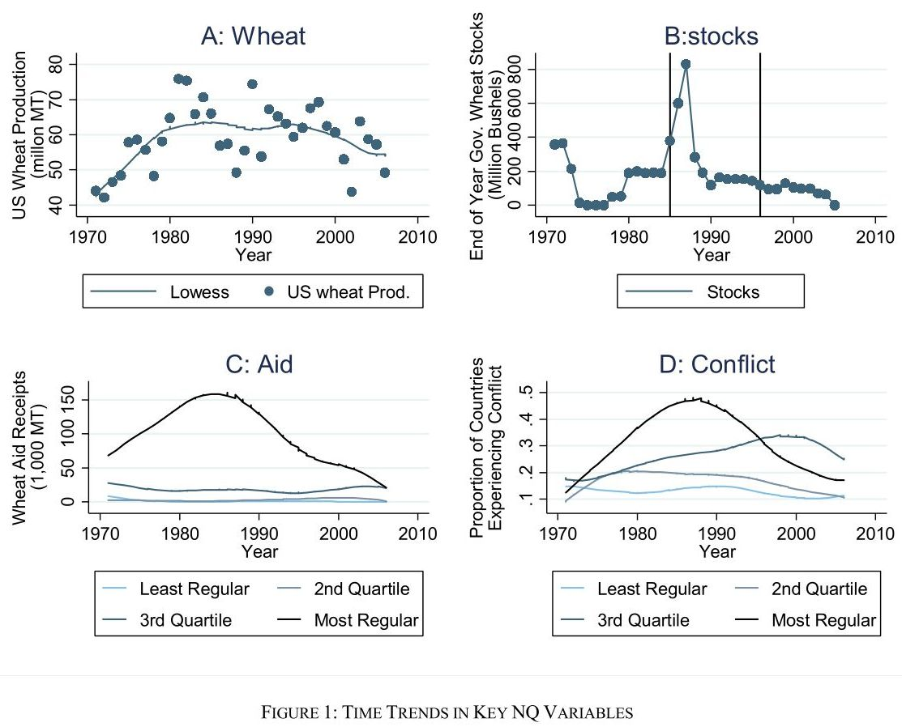

```{css, echo=FALSE}
.SeiroBenign {
  background-color: #FFEBCD;
  padding: 0.5em; /*文字まわり（上下左右）の余白*/
  /* border: 1px solid yellow; */
  /* font-weight: bold; */
}
.SeiroLightGreen {
  background-color: #D0F0C0; /* Tea green */
  padding: 0.5em; /*文字まわり（上下左右）の余白*/
  font-family: Noto S	ans;
  /* border: 1px solid yellow; */
  /* font-weight: bold; */
}
```

```{r setup, include=FALSE} 
# include = F <==> echo=F & results = F
library(tufte)
# invalidate cache when the tufte version changes
knitr::opts_chunk$set(tidy = FALSE, cache.extra = packageVersion('tufte'), 
  margin_references = TRUE,
  # remove leading hashes in html output
  comment = "", class.source = "SeiroBenign", class.output = "SeiroLightGreen")
options(htmltools.dir.version = FALSE)
```
```{css echo=FALSE}
/* Define a margin before hX (header level X) element */
h1  {
  margin-top: 3ex;
  margin-bottom: 3ex;
  /* background: #c2edff; */ /*背景色*/
  padding: 0.5em;/*文字まわり（上下左右）の余白*/
}
h2  {
  margin-top: 2ex;
  margin-bottom: 2ex;
  padding: 0.5em;/*文字周りの余白*/
  color: #010101;/*文字色*/
  /* background: #eaf3ff; */ /*背景色*/
  /* border-bottom: solid 3px #516ab6; */ /*下線*/
}
```
\def\Perp{\mkern2mu\rotatebox[origin=c]{90}{$\models$}\mkern2mu}
\newcommand{\cnvp}{\stackrel{p}{\longrightarrow}}

# Summary

* Bartik instrument can be interpreted as exogenous shock IV with endogenous exposure shares.  
* Orthogonality: Shock level unobservable $\bar{\epsilon}_{n}$ and mean-exposure-multiplied shocks $s_{n}g_{n}$.  
* Can use usual IV commands for estimation and inference once data is transformed. 
* Need large number of sectors $N$ and dispersed shocks for cross section data.  
* Need large number of sectors $N$ and location $L$ for short panels, need large $T$ and small $L, N$ for long panels.  


# Intro

Bartik instrument: In each locality $l$, weighted mean of sector wise shocks $g_{n}$.
$$
\begin{aligned}
y_{l}
&=
\alpha + \beta x_{l}+\gamma'w_{l}+\epsilon_{l},\\
x_{l}
&=
a_{0}+a_{1}z_{l}+a'_{2}w_{l}+\omicron_{l}, \quad z_{l}=\sum_{n}s_{ln}g_{n},
\end{aligned}
$$

* $y_{l}$: Wage growth in locality $l$.
* $x_{l}$: Employment growth at $l$.
* $s_{ln}$: Lagged employment share of industry $n$ of location $l$ to total employment of $l$.  
* $g_{n}$: Aggregate shocks on industry $n$.  
* $w_{l}$: A covariate vector.  

$x_{l}$ is endogenous as demand and supply factors affect it. Need an instrument that is orthogonal to supply shocks. Bartik IV.  

```{marginfigure}
```

# BHJ's interpretation of Bartik instruments

IV
$$
z_{l}=\sum_{n}s_{ln}g_{n}.
$$
Bartik moment condition
$$
\mathbb E\left[\sum_{l}e_{l}z_{l}\epsilon_{l}\right]=0.
$$

* $e_{l}$: Total employment of location $l$ to US total.  

This moment condition suggests an estimator:
\begin{equation}
\hat{\beta}=\frac{\sum\limits_{l}e_{l}z_{l}y^{\perp}_{l}}{\sum\limits_{l}e_{l}z_{l}x^{\perp}_{l}}
\tag{4}\label{eqn4}
\end{equation}

* $y^{\perp}_{l}$: Residuals from projection of $y_{l}$ on $w_{l}$.  

## Insights

Shock-level orthogonality
$$
\begin{aligned}
E\left[\sum_{l}e_{l}z_{l}\epsilon_{l}\right]
&=
E\left[\sum_{l}e_{l}\sum_{n}s_{ln}g_{n}\epsilon_{l}\right]
=
E\left[\sum_{n}\sum_{l}e_{l}s_{ln}g_{n}\epsilon_{l}\right],\\
&=
E\left[\sum\limits_{n}g_{n}\frac{\sum\limits_{l}e_{l}s_{ln}\epsilon_{l}}{\sum\limits_{l}e_{l}s_{ln}}\sum\limits_{l}e_{l}s_{ln}\right],\\
&=
E\left[\sum_{n}s_{n}g_{n}\bar{\epsilon}_{n}\right],  \quad \Leftarrow s_{n}=\sum_{l}e_{l}s_{ln}, \bar{\epsilon}_{n}=\sum\limits_{l}\frac{e_{l}s_{ln}\epsilon_{l}}{\sum\limits_{l}e_{l}s_{ln}}\\
&=
0 \quad \Leftarrow \mbox{Need }s_{n}g_{n}\perp\bar{\epsilon}_{n}.
\end{aligned}
$$
Exposure weighted (supply) shocks to be orthogonal to mean employment share $\times$ industry shocks. Tough to understand. But exogenous industry shocks are not too difficult to find.  

GSS (2020)'s interpretation of Bartik IV identification: Exogenous (or random) shares $s_{ln}$ and nonrandom $g_{n}$.
$$
\begin{aligned}
E\left[\sum_{n}\sum_{l}e_{l}s_{ln}g_{n}\epsilon_{l}\right]
&=
\sum_{n}g_{n}E\left[\sum_{l}e_{l}s_{ln}\epsilon_{l}\right], \quad \Leftarrow \mbox{Non random }g_{n}\\
&=
0 \quad \Leftarrow \mbox{Need }e_{l}s_{ln}\perp\epsilon_{l}.
\end{aligned}
$$
This is unlikely to hold. 

## Main results

Shock-level orthogonality leads to shock-level estimation.
$$
\begin{aligned}
\bar{y}^{\perp}_{n}
&=
\alpha +\beta \bar{x}^{\perp}_{n} + \bar{\epsilon}^{\perp}_{n},\\
x^{\perp}_{n}
&=
a_{0}+a_{1}g_{n}+\omicron_{n}.
\end{aligned}
$$
Given below, one can estimate $\beta$ by:  

1. Construct covariate vector $w_{l}=(\tilde{w}_{l}, \grave{w}_{l})$ with shock-level covariates $\tilde{w}_{l}=\sum\limits_{n}s_{ln}q_{n}$ and observation-level covariates $\grave{w}_{l}$.
1. Get residuals $x^{\perp}_{l}, y^{\perp}_{l}$ from projection of $x,y$ on $w$.  
1. Transform residuals using $\bar{x}^{\perp}_{n}=\frac{\sum\limits_{l}e_{l}s_{ln}x^{\perp}_{l}}{\sum\limits_{l}e_{l}s_{ln}}$.  
1. Multiply $\bar{x}^{\perp}_{n}, \bar{y}^{\perp}_{n}$ with weights $s_{n}$.
1. Use $g_{n}$ as an IV to the above estimating equation using $s_{n}\bar{x}^{\perp}_{n}, s_{n}\bar{y}^{\perp}_{n}$.  
1. Do robust (SE) inference.  

This is OK, because, starting from \eqref{eqn4}, we end up using $g_{n}$ as an IV on $s_{n}\bar{x}^{\perp}_{n}$ with $s_{n}\bar{y}^{\perp}_{n}$:
$$
\begin{aligned}
\hat{\beta}
&=
\frac{\sum\limits_{l}e_{l}z_{l}y^{\perp}_{l}}{\sum\limits_{l}e_{l}z_{l}x^{\perp}_{l}} = 
\frac{\sum\limits_{l}e_{l}\left(\sum\limits_{n}s_{ln}g_{n}\right)y^{\perp}_{n}}{\sum\limits_{l}e_{l}\left(\sum\limits_{n}s_{ln}g_{n}\right)x^{\perp}_{n}} = 
\frac{\sum\limits_{n}s_{n}g_{n}\bar{y}^{\perp}_{n}}{\sum\limits_{n}s_{n}g_{n}\bar{x}^{\perp}_{n}},\\
&=
\frac{\mbox{cov}[s_{n}\bar{y}^{\perp}_{n}, g_{n}]}{\mbox{cov}[s_{n}\bar{x}^{\perp}_{n}, g_{n}]}.
\end{aligned}
$$

::: {.proposition #prop2 name="Proposition 2"}
**Proposition 2**  
The moment condition holds under: Assumption 1: $\mathbb E\left[g_{n}|\bar{\epsilon}, s\right]=\mu$.  
:::  

$$
\begin{aligned}
\mathbb E\left[\sum_{l}e_{l}z_{l}\epsilon_{l}\right]
&=
\mathbb E\left[\sum_{n}s_{n}g_{n}\bar{\epsilon}_{n}\right]
=
\mu\mathbb E\left[\sum_{n}s_{n}\bar{\epsilon}_{n}\right],\\
&=
\mu\mathbb E\left[\sum_{n}\left(\sum\limits_{l}e_{l}s_{ln}\right)\frac{\sum\limits_{l}e_{l}s_{ln}\epsilon_{l}}{\sum\limits_{l}e_{l}s_{ln}}\right],\\
&=
\mu\mathbb E\left[\sum\limits_{l}e_{l}\epsilon_{l}\left(\sum_{n}s_{ln}\right)\right],\\
&=
\mu\mathbb E\left[\sum\limits_{l}e_{l}\epsilon_{l}\right] \quad \because \sum_{n}s_{ln}=1\\
&=
0  \quad \because \mbox{national employment weight}\perp \mbox{L supply shocks (probably)}\\
\end{aligned}
$$

::: {.proposition #prop3 name="Proposition 3"}
**Proposition 3**  
$\hat{\beta}\cnvp \beta$ under relevancy condition, Assumption 1, Assumption 2: $\mathbb E\left[\sum\limits_{n}s^{2}_{n}\right]\rightarrow 0$, cov$[g_{n}, g_{n'}|\bar{\epsilon}, s]=0$.
:::  
* Relevancy: $\sum\limits_{l}e_{l}z_{l}x^{\perp}_{l}\cnvp \pi\neq 0$ as $L\rightarrow\infty$.  
* $\mathbb E\left[\sum\limits_{n}s^{2}_{n}\right]\rightarrow 0$ is dispersed shock exposure. Note Herfindal index is minimised if each share is $\frac{1}{N}$, so dispersed shocks gives a value closer to 0.  
* cov$[g_{n}, g_{n'}|\bar{\epsilon}, s]=0$ is dispersed shocks.  


## Relaxing assumptions 1, 2

::: {.proposition #prop4 name="Proposition 4"}
**Proposition 4**  
$\hat{\beta}\cnvp \beta$ under relevancy condition, Assumption 3, Assumption 4 (replaceable with Ass 5 or 6) with shift-share constructed observables $\tilde{w}_{l}=\sum\limits_{n}s_{ln}q_{n}$.
:::  
* Assumption 6: Allows many weakly uncorrelated shocks. Shocks across industries can be correlated but only weakly, or with some upper bound.  

## Extensions

### Estimated shocks

Use leave one out IV estimator. Because, if $z_{l}$ is measured with errors, $z_{l}$ includes structural errors $\epsilon_{l}$ and induces a correlation with residuals. 
\[
z^{LOO}_{l}=\sum_{n}s_{ln}g_{n,-l}, \quad
g_{n,-l}=\frac{\sum\limits_{l'\neq l}\omega_{l'n}g_{nl'}}{\sum\limits_{l'\neq l}\omega_{l'n}}.
\]

### Incomplete shares

Use $S_{l}=\sum\limits_{n}s_{nl}$ as a covariate. If a location has a zero exposure share in the industry with shocks, sum of exposure share does not add up to one. $S_{l}$'s differ by location $l$.  

* Consider industry $n=0$ with the missing shock $g_{0}=0$. Then, Ass 3 is violated because it requires $\mathbb E[g_{n}|s, \bar{\epsilon}]=0$ for $n=0$ and $\mathbb E[g_{n}|s, \bar{\epsilon}]=0$ for $n>0$.  
* Let $\mathbb E[g_{n}|s, \bar{\epsilon}]=0$ for $n=0$ and $\mathbb E[g_{n}|s, \bar{\epsilon}]\neq 0$ for $n>0$. That is, condition $n>0$ for the covariate to have different means so the difference in shocks is accounted for in estimating impacts on $y_{l}$. This is done by conditioning on $S_{l}=\sum\limits_{n}s_{nl}I[n>0]$.  
* It suffices to control for $S_{l}$, assuming $S_{l}$ is exogenous.
\[
\begin{aligned}
\sum_{n=0}^{N}s_{n}g_{n}\bar{\epsilon}_{n}
&=\mathbb E\left[\sum_{n=0}^{N}s_{n}(g_{n}-\mu)\bar{\epsilon}_{n}\right] + \omicron_{p}(1),\\
&=
-\mu\mathbb E\left[s_{0}\bar{\epsilon}_{0}\right] + \omicron_{p}(1),\\
&=
-\mu\mathbb E\left[\sum\limits_{l}e_{l}(1-S_{l})\epsilon_{l}\right] + \omicron_{p}(1), \quad \because \sum_{n=0}^{N}s_{nl}=s_{0l}+\sum_{n=1}^{N}s_{nl}=s_{0l}+S_{l}=1\\
&\cnvp 
0 \quad \mbox{if $S_{l}$ is exogenous.}
\end{aligned}
\]

### Panel

* Consistency follows in short panels (fixed $N, T$ with $L\rightarrow\infty$) and long panels ($T\rightarrow\infty$, $N, L$ fixed and small).  
* Need to include $S_{lt}$ as a covariate if incomplete shares. To purge time-invariant shocks and if exposure shares differ by period, one needs to deflate/control with sum of exposure shares in each period.  
  * Same as "Period FE $\times S_{l}$."
* Can also do FD-IV:

$$
\begin{aligned}
\Delta y_{lt}
&=
\beta\Delta x_{lt}+\gamma'\Delta w_{lt}+\delta \epsilon_{lt},\\
z^{FD}_{lt}
&=
\sum_{n}s_{ln, t-1}\Delta g_{nt}.
\end{aligned}
$$

### Falsification tests 

* Use observation-level confounders $r_{l}$, shock-level confounders $r_{n}$: Baseline characteristics of $l$ or $n$, pre-trend of $y_{l}$.  
* Regress $r_{l}$ on $z_{l}$ or $g_{n}$ to show confounders are not correlated with IV nor driving shocks.  
$$
\begin{aligned}
r_{l}
&=
a_{0}+a_{1}z_{l}+a_{2}w_{l}+\eta_{al},\\
r_{l}
&=
b_{0}+b_{1}x_{l}+b_{2}w_{l}+\eta_{bl}, \quad \mbox{IV with }z_{l}.\\
r_{n}
&=
c_{0}+c_{1}g_{n}+\eta_{cn},\\
\tilde{r}_{l}
&=
d_{0}+d_{1}z_{l}+d_{2}w_{l}+\eta_{dl}, \quad \tilde{r}_{l}=\sum_{n}s_{ln}r_{n}.\\
\tilde{r}_{l}
&=
h_{0}+h_{1}x_{l}+h_{2}w_{l}+\eta_{hl}, \quad \mbox{IV with }z_{l}.\\
\end{aligned}
$$

# Autor, Dorn, Hanson (2013): China syndrome

* Repeated cross section of:  
  * 722 commuting zones $l$  
  * 397 4 digit SIC manufacturing industries  
  * 2 periods, 1990-2000, 2000-2007.  

$y_{lt}$: Changes in total manufacturing employment as \% of working age population  

$x_{lt}$: Exposure to imports from China  
$$
x_{lt}=\sum_{n}s_{lnt}^{\mbox{current}}g_{nt}^{\mbox{US}}, \quad 
g_{nt}^{\mbox{US}}=\frac{\Delta \mbox{manuf imports}_{nt}}{n\mbox{'s emp at start of }t}.
$$

$z_{lt}$: IV for $x_{lt}$  
$$
z_{lt}=\sum_{n}s_{ln,t-10}g_{nt}, \quad 
g_{nt}=\frac{\Delta \mbox{manuf imports in 8 countries}_{nt}}{n\mbox{'s emp in US 10 years ago}}.
$$
Origins of shocks $g_{nt}$: China, 8 countries other than US. Local labour supply shocks are not included.  

$w_{lt}$: Controls, including: start of period labour force demographics, period FE, census region FEs, start of perod total manufacturing shares  

$e_{lt}$: Start of period population  

Sum of lagged manufacturing shares $S_{lt}=\sum\limits_{n}s_{lnt}$ is not constant across $l$: ``incomplete shares'' case

A thought experiment:  

* Random TFP changes in industries in China  
$\Rightarrow$ (Ass 1) Exogeneity is satisfied.  
* Random TFP changes are not correlated between industries  
$\Rightarrow$  (Ass 2) Uncorrelated shocks is satisfied. Table 2 reports this is the case using hierarchical random effects model (11) which gives low intra-class correlations estimates.  
```{marginfigure}
|Table 1 contents             |
|-----------------------------|
|mean                         |
|std dev                      |
|Effective sample size (1/HHI)|
| across industries and period|
| across SIC3 groups          |
|Largest $s_{nt}$ weight      |
| across industries and period|
| across SIC3 groups          |
|                             |
```
* Large number of dispersed shocks.  
$\Rightarrow$  (Ass 2) Vanishing squared sum of shocks is satisfied. Table 1 reports this is the case if service sector is excluded from local employment.  
* Conditional random shock assignment (relaxing Ass1)  
$\Rightarrow$ (Ass 3) Table 3 Panel A show no correlation between shocks and industry level potential confounders.  Panel B shows two possible confounding. Last 2 rows of Panel B are pre-trend analysis.  
```{marginfigure}
ADH: 1970's is distant past. 
```
  * Positive correlation with \% of foreign born population.  
  * Positive correlation with 1970's employment growth.  

```{marginfigure}
Could have said: 10 out of 12 falsifcation tests show no correlation of IVs with confounders.
```  

* Imbalance of foreign born shares and 70's growth bias estimates only if they are correlated with structural errors $\epsilon_{lt}$. Include them as a covariate.  

Table 3                                                Coeff   se
----------------------------------------------------- ------- -----
**Panel A** ($r_{n}$)                                  
prod worker share in employment 1991                  -0.011  0.012
ratio of capital to value added 1991                  -0.007  0.109
log real wage (2007USD) 1991                          -0.005  0.022
computer investment as share of total 1990            0.750   0.465
high-tech equipment as share of total investment 1990 0.532   0.296
**Panel B** ($r_{l}$)[start-of-period]
\% college educated population                        0.915   1.196
\% foreign-born population                            2.920   0.952
\% employment among women                             -0.159  0.521
\% employment in routine occupations                  -0.302  0.272
average offshoreability index of occupations          0.087   0.075
manufacturing employment growth 1970's                0.543   0.227
manufacturing employment growth 1980's                0.055   0.187

Main results show robustness to inclusion of covariates and incomplete share covariates. 

Table 4                   (1)     (2)     (3)     (4)
---------------          ------- ------- ------- -------
Coefficient               -.596   -.489   -.267   -.314
                          (.114)  (.100)  (.099)  (.107)
Autor controls              Y       Y      Y         
Mfg share                   Y                        
Lagged mfg share                   Y       Y       Y
Period lagged mfg share                     Y      Y
-------------             ------- ------- ------- -------

# Possible applications

### Card2009: Immigration and wages

$y_{lj}$: Log wage gap of immigrant and naitive men of skill $j$, location $l$  
$x_{lj}$: Log ratio of immigrant to naitive hours for $j,l$  
$g_{jn}$: Growth in US immigration for industry $n$, skill $j$  
$z_{lj}=\sum_{n}s_{ln}g_{jn}$

### @NunnQian2014: US food aid and civil conflicts

$y_{lt}$: Indicator function of conflict in country $l$, period $t$.  
$x_{lt}$: Quantity of wheat aid shipped from US.  
$g_{t-1}$: US wheat production in $t-1$.  
$s_{l}$: Country $l$'s propensity to receive food aid from US.  
$z_{lt}=s_{l}g_{t-1}$  

* Authors compare B-IV and DID: Continuous vs. binary treatment. They control regionwise period effects. No mention on Bartik instrument, though.  


```{marginfigure}
{width=400px}
```

### @ChristianBarrett2017: Critisims on @NunnQian2014 as not valid IV

* Mean conflict, mean wheat aid, and US wheat production follow a similar inverted-U shape trend for countries that receive food aid most often. This suggests wheat production IV is invalid. 
* CB argue that region-year, country FEs and linear time trend do not eliminate this source of endogeneity. 


### BeaudryGreenSand2012: Interindustry wage growth under a job search equilibrium
s
$y_{lt}$: Wage growth in city $l$, period $t$.  
$x_{lt}$: National level wage premium adjusted for $l$'s employment share structure.  
$ER_{lt}$: Employment growth.  

* Both $x_{lt}$ and $ER_{lt}$ are derived from a search theoretic model with unemployment utility probability depending on probability of receiving an offer from all industries, where shares of vacancy $\eta_{cj}$ introduced to (4) and eventually to the derived estimating equation. Exposure shares to other industries of realised wages are introduced nicely by using a well established theory. However, identification assumption is never explicitly discussed. They use both shares and macro shocks as exogenous. 

IV1 (share growth)  
$\Delta\hat{\eta}_{cjt}$: Growth in city $c$'s industry $j$ employment share with employment in $t$ predicted by lagged employment.  
$\nu_{jt}$: Industry $j$'s wage premium at $t$.  
$z_{1ct}=\sum\limits_{j}\nu_{jt}\Delta\hat{\eta}_{cjt}$

IV2 (wage premium shock growth)  
$\Delta\nu_{jt}$: Growth in industry $j$'s wage premium in $t$.  
$\hat{\eta}_{cjt}$: City $c$'s industry $j$ employment share in $t$ predicted by lagged employment.  
$z_{2ct}=\sum\limits_{j}\hat{\eta}_{cjt}\Delta\nu_{jt}$  

IV3 (employment shock growth. p.1083)  
$g_{jt}$: National employment growth in industry $j$ at $t$.  
$s_{cjt}$: City $c$'s industry $j$ employment share.  
$z_{ct}=\sum\limits_{j}s_{cjt}g_{jt}$  

### Diamond2016: Wage growth and Bartik labour demand shocks as controls

$y^{k}_{lt}$: Wage growth of type $k$ labour in city $l$, period $t$.  
$g^{k}_{nt}$: Wage growth of type $k=L, H$ labour in industry $n$ at $t$ other than in $l$.  
$s_{lnt_{0}}$: Industry $n$ employment share in total city $l$ employment at $t_{0}$.  
$z^{k}_{lt}=\sum\limits_{n}s_{lnt_{0}}g^{k}_{nt}$  


### DurantonTurner2011: Vehicle-kilometer traveled and population, highway construction

Table 5:  
$y_{lt}$: Growth of VKT in $l$ at period $t$.  
$x_{lt}$: Population growth in $l$ at $t$.  
$g_{nt}$: National growth of industry $n$ at $t$.  
$s_{lnt_{0}}$: Industry $n$'s employment share of $l$ at $t_{0}$.  
$z_{lt}=\sum\limits_{n}s_{lnt_{0}}g_{nt}$  

* Authors explicitly refer to Bartik.  

### Aizer2010: Domestic violence and gender wage gaps

$y_{lt}$: Growth of DV in $l$ at period $t$.  
$x_{lt}$: Wage gap growth in $l$ at $t$.  
$g_{nt}$: State wise wage growth of industry $n$ at $t$.  
$s_{lnt}$: Industry $n$'s employment share of $l$ at $t_{0}$.  
$z_{lt}=\sum\limits_{n}s_{lnt_{0}}g_{nt}$  

* State wise wage growth of industry $n$ affects gender wage gaps as certain industries are dominated with men/women. The wage growth of female-labour-intrensive industry increases the female wages relative to men. The identification assumption is that industrty-by-state wise wage growth should be orthogonal to population traits that may be correlated with domestic violence.  

### @Berman2017: Mine operation and conflicts

$y_{lt}$: Growth of conflicts in cell $l$ at period $t$.  
$x_{lt}$: Growth of economic values of mines in $l$ at $t$.  
$g_{nt}$: Growth of price of mineral $n$ at $t$.  
$s_{lnt}$: Presence of mine of mineral $n$ in $l$ at $t$.  
$z_{lt}=\sum\limits_{n}s_{lnt}g_{nt}$  

* Estimation specification uses any mineral operating in cell $l$, not the weighted average, thereby imposing the same coefficient for 14 different minerals.  


```{r bib, include=FALSE}
# create a bib file for the R packages used in this document
knitr::write_bib(x = "rmarkdown", file = paste0(path, 'seiro.bib'))
```

# References
